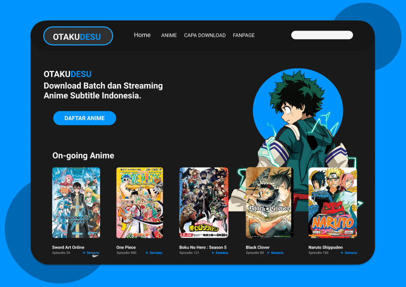

<h1 align="center">OTAKUDESU</h1>

Site de animes para você acompanhar o seu anime atual favorito.
  Este é o link do site que foi tirada a imagem que eu me baseei para fazer o site <a href="https://dribbble.com/">Dribbble</a>.
 Aqui está o link da imagem que o site foi feito <a href="https://dribbble.com/shots/13921415-ANIME-WEB-STREAM-REDESIGN-OTAKUDESU/attachments/5531194?mode=media">Otakudesu</a>.

### Tecnologias
- HTML5
- CSS
- JavaScript
- SASS / SCSS

### Objetivo do Projeto

<h4>Esse projeto foi criado para consolidar os assuntos que eu já vinha estudando de cursos, ficar mais incentivado e continuar progredindo cada vez mais na área.</h4>

### Link do site

Github Pages > <a href="https://thiago-barreto-r.github.io/Otakudesu/">Otakudesu</a>

### Autor

<<<<<<< HEAD
**Nome**: *Thiago B. Rodrigues*
 
 
**Obs: O projeto ainda não está completo**.
=======
Link da página do site <a href="https://thiago-barreto-r.github.io/Otakudesu/">OTAKUDESU</a>
>>>>>>> 3aebd7744a24f295c9445cd97067099e50cf7891
