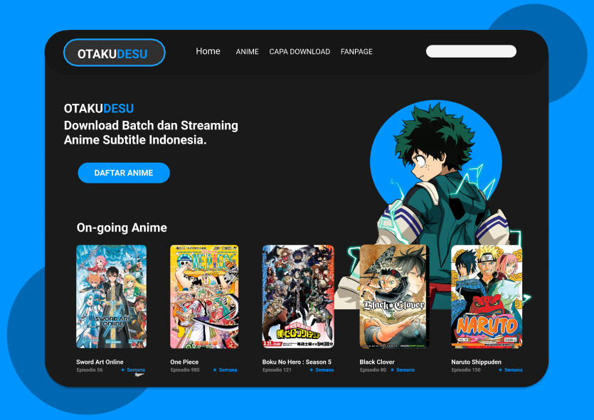

<h1 align="center">Clone OTAKUDESU</h1>

OTAKUDESU

Clone da interface <a href="https://dribbble.com/shots/13921415-ANIME-WEB-STREAM-REDESIGN-OTAKUDESU/attachments/5531194?mode=media">OTAKUDEKU</a> peguei o layout no site dribbble.

### Tecnologias
- HTML5
- CSS
- SASS / SCSS

**obs: O site ainda não está responsivo**.

### imagem final do site

Link da página do site <a href="https://thiago-barreto-r.github.io/Anime-List/">OTAKUDESU</a>